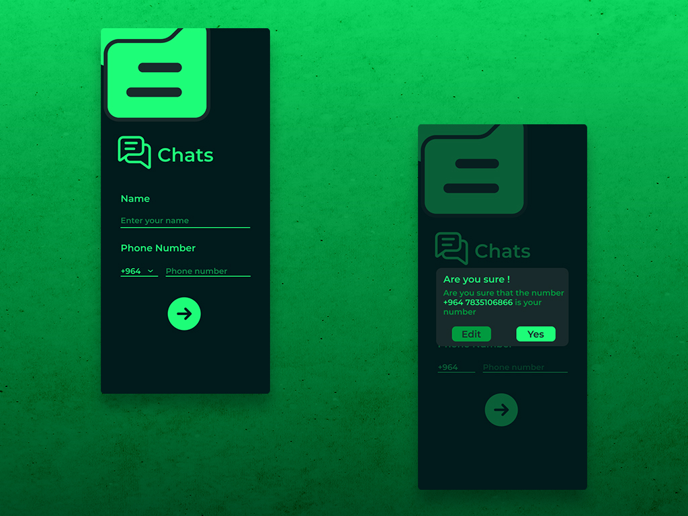
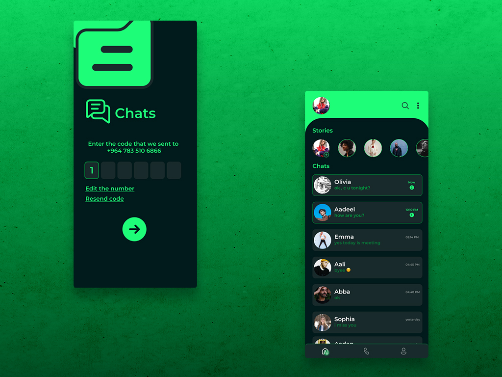
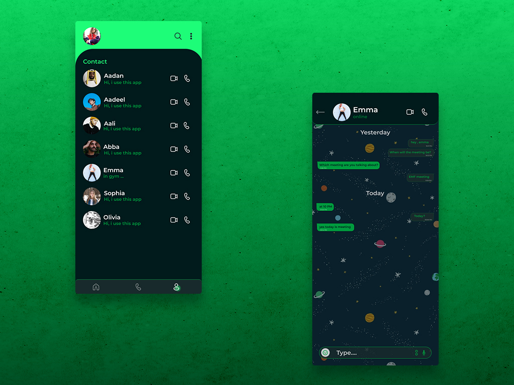

# ⭐ Chat App

<div align="center">

[](https://flutter.dev/docs)
[](https://firebase.google.com/docs)
[](https://code.visualstudio.com/ "Visual Studio Code")

</div>

Welcome ,That is a flutter chat app built with Firestore and Firebase Cloud. It is clone of whatsapp messenger.User can create stories,chat and search in real time.

<br><br>  

## 📱 Demo


https://user-images.githubusercontent.com/56196099/186564473-3734d895-35d5-493f-a708-3191facb6db7.mp4






<br><br>

## ⤵ Installation

In the command line:

    $ git clone https://github.com/ramiyar2/chat-app.git
    $ cd chat_app/
    $ flutter run

#### 🤖 For running on Android or IOS emulator   

    Make sure you have an emulator installed and running.
    Run the following command in your terminal.
    $ flutter run

**Note:** Make sure your Flutter environment is setup. [help](https://flutter.dev/docs/get-started/install)

A few resources to get you started if this is your first Flutter project:

- [Lab: Write your first Flutter app](https://docs.flutter.dev/get-started/codelab)
- [Cookbook: Useful Flutter samples](https://docs.flutter.dev/cookbook)

For help getting started with Flutter development, view the
[online documentation](https://docs.flutter.dev/), which offers tutorials,
samples, guidance on mobile development, and a full API reference.

<br><br>

## ✅ Features
- User Authentication.
- Realtime chat.
- Send text messages, stickers, GIFs & Images.
- create individual and group chats and delete them
- view and add messages
- light mode(coming soon)
- notification(coming soon)
- instant messages
- Video and voice calling.

<br><br>

## 💻 Tools used
- [Figma](https://www.figma.com/)
- [Flutter & Dart](http://flutter.dev)
- [Firebase  Flutter](https://firebase.google.com/)
- [MobX State Management](https://pub.dev/packages/mobx)
- [Shared Preferences](https://pub.dev/packages/shared_preferences)

<br><br>

## 📠 Reach Me 

[](https://twitter.com/ramiyar_yusf) 
[](https://fb.com/ramyaryusf26) 
[](https://instagram.com/ramiyaryusf) 
[](https://www.behance.net/ramiyar) 
[](mailto:aa3567878@gmail.com) 
[](https://www.linkedin.com/in/ramyar-yusf-393a40203/)
<br><br>

# 📄 License
```
MIT License

Copyright (c) 2020 Ramiyar yusf

Permission is hereby granted, free of charge, to any person obtaining a copy
of this software and associated documentation files (the "Software"), to deal
in the Software without restriction, including without limitation the rights
to use, copy, modify, merge, publish, distribute, sublicense, and/or sell
copies of the Software, and to permit persons to whom the Software is
furnished to do so, subject to the following conditions:
The above copyright notice and this permission notice shall be included in all
copies or substantial portions of the Software.

THE SOFTWARE IS PROVIDED "AS IS", WITHOUT WARRANTY OF ANY KIND, EXPRESS OR
IMPLIED, INCLUDING BUT NOT LIMITED TO THE WARRANTIES OF MERCHANTABILITY,
FITNESS FOR A PARTICULAR PURPOSE AND NONINFRINGEMENT. IN NO EVENT SHALL THE
AUTHORS OR COPYRIGHT HOLDERS BE LIABLE FOR ANY CLAIM, DAMAGES OR OTHER
LIABILITY, WHETHER IN AN ACTION OF CONTRACT, TORT OR OTHERWISE, ARISING FROM,
OUT OF OR IN CONNECTION WITH THE SOFTWARE OR THE USE OR OTHER DEALINGS IN THE
SOFTWARE.
```
